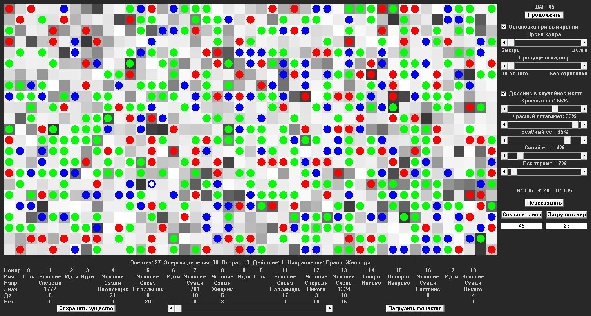

# $\mathbb{\color[RGB]{255,60,0}{Игра \ «Симуляция \ жизни» \ (Графическое, \ Windows)}}$

## $\mathbb{\color[RGB]{255,90,0}{Основная \ информация}}$

### $\mathbb{\color[RGB]{255,127,0}{Стек \ технологий \ разработки}}$

- $\mathbb{\color[RGB]{252,193,83}{C++}}$
	+ Библиотека $\mathbb{\color[RGB]{252,193,83}{Win \ API}}$.
	+ Библиотека $\mathbb{\color[RGB]{252,193,83}{STL}}$.
	+ Красивое $\mathbb{\color[RGB]{252,193,83}{ООП}}$ с большим количеством $\mathbb{\color[RGB]{252,193,83}{наследования}}$.
	+ Голые $\mathbb{\color[RGB]{252,193,83}{указатели}}$, тестирование на утечки.

### $\mathbb{\color[RGB]{255,127,0}{Среды \ разработки}}$

- Visual Studio 2019
- $\mathbb{\color[RGB]{252,193,83}{Deleaker}}$

### $\mathbb{\color[RGB]{255,127,0}{Фото \ симуляции}}$

### $\mathbb{\color[RGB]{255,127,0}{Описание}}$

&emsp;&emsp;Три вида клеток: 
&emsp;&emsp;&emsp; ${\color{red}Красные}$ - хищники. 
&emsp;&emsp;&emsp; ${\color{green}Зелёные}$ - растения. 
&emsp;&emsp;&emsp; ${\color{blue}Синий}$ - падальщик. 
&emsp;&emsp;У каждой из них своя программа, которая передаётся по наследству, возможно, с мутациями. 
&emsp;&emsp;У мира такие свойства, что без одного из видов клеток, все клетки вымрут через время. 
&emsp;&emsp;Есть возможность сохранять мир и существ, менять настройки мира и его размер 

## $\mathbb{\color[RGB]{255,90,0}{Дата}}$

&emsp;&emsp; $\mathbb{\color[RGB]{252,193,83}{Лето \ 2022г.}}$

## $\mathbb{\color[RGB]{255,90,0}{Заключение}}$

&emsp;&emsp; Получаются довольно забавные живые обои.